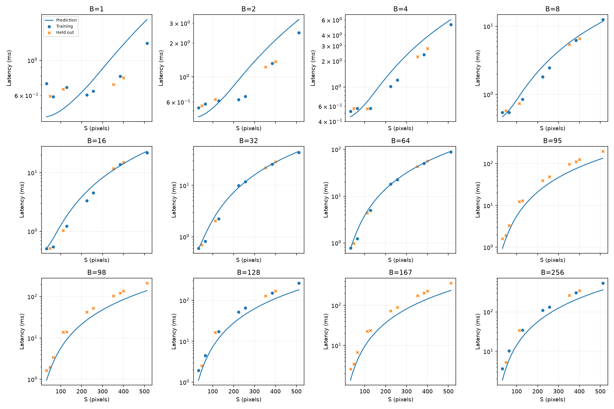
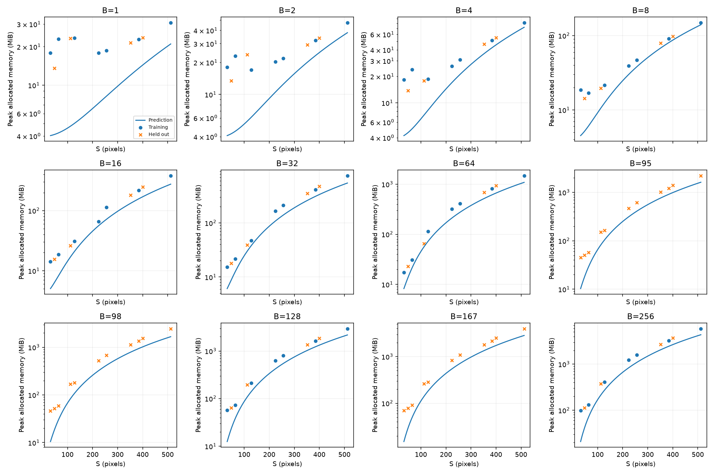
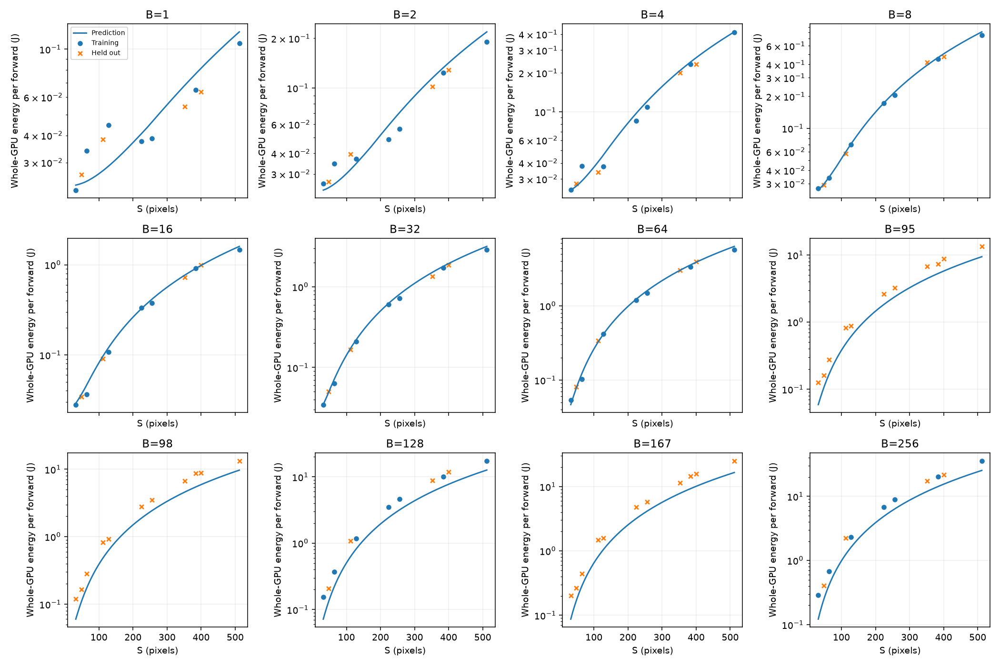

# HW1 — Analytical performance model of a small CNN

Задание: https://github.com/On-Point-RND/Efficient-Models-course-ITMO-2026/blob/main/home_work_one.md

Kaggle: https://www.kaggle.com/code/doifgoox/itmo-cnn-cost-lab-hw1

## Материалы для проверки

- [Рукописное описание формул (PDF)](hw1_handwritten.pdf).
- [Код функций FLOPs, Memory, Latency и Energy](equations.py).
- [Графики сравнения с измерениями](results/figures/) — 8 PNG-файлов; основные графики также приведены в конце отчёта.
- [Исходные измерения](results/measurements.csv) и [параметры моделей](results/theta.json).

## Запуск

Открыть `kaggle_run.ipynb` в Kaggle, включить GPU T4 и Internet, выполнить Run All. Используется только GPU 0. Веса не обучаются; входы случайные. Результаты сохраняются в `/kaggle/working/hw1/results` и архив `/kaggle/working/cnn-cost-lab-results.zip`.

Альтернатива на NVIDIA GPU, из папки `hw1/`:

```bash
python -m pip install -r requirements.txt
python measure.py
python calibrate.py
```

Не запускать измерения на CPU: `measure.py` требует CUDA. Результаты используют FP32, eval(), inference_mode(), cudnn.benchmark=False, cudnn.allow_tf32=False, matmul.allow_tf32=False. Точные версии и модель GPU записываются в `results/environment.json`.

## Файлы

- `models.py`: заданная сеть, 1 040 324 параметра.
- `equations.py`: четыре векторизованные функции и послойная модель трафика.
- `measure.py`: полная сетка 11×12, фиксированный seed=2026, OOM handling, latency/memory/energy.
- `calibrate.py`: fit только на базовой сетке, метрики на отложенных точках, графики.
- `kaggle_run.ipynb`: автономный notebook; дополнительно проверяет Conv/Linear FLOPs через PyTorch profiler.
- [hw1_handwritten.pdf](hw1_handwritten.pdf): рукописное описание формул.
- [DERIVATIONS_RU.md](DERIVATIONS_RU.md): подробные печатные выводы формул.
- [COPY_BY_HAND.md](COPY_BY_HAND.md): краткая печатная версия формул.
- `results/measurements.csv`: измерения; секунды, байты, джоули.
- `results/theta.json`: параметры моделей.
- `results/SUMMARY_RU.md`: реальные результаты и обсуждение.
- `results/figures`: сравнения предсказаний с измерениями.

## Основные формулы

F = B(17714 S² + 313700) FLOPs.

M ≈ 4161296 + 68BS² bytes — оценка живых тензоров, включая временные int64-индексы MaxPool. Workspace cuDNN не включён.

Q = 380BS² + 8592B + 4161296 bytes — логический трафик 17 операторов, не измеренный DRAM traffic.

T = 17τ + Σ_i max(F_i/C, Q_i/D).

E = αF + βQ + P₀T.

ReLU/MaxPool comparisons исключены из арифметических FLOPs. Влияние сравнений на время приближённо отражается в эффективных параметрах. Полный вывод и ограничения — в `DERIVATIONS_RU.md`.

## Протокол и ограничения

Latency — median of 9 synchronized host wall-clock forwards after 3 warmups. Peak memory — max_memory_allocated после reset_peak_memory_stats при живых входе и весах, без предыдущего выхода. Energy — whole-GPU average per forward over a sustained series targeting ~1.2 s (observed 0.894–1.745 s); NVML cumulative counter preferred, power integration fallback. Idle power is not subtracted. Все дополнительные случайные S/B удерживаются от fit; они проверяют обобщение на новые размеры, а не только на повторные замеры.

Коэффициенты latency и energy эффективные и зависят от GPU/ПО. Модель памяти не описывает закрытый workspace и фрагментацию; FLOPs не равны числу аппаратных инструкций. Данные профайлера FLOPs включают только Conv/Linear MACs, поэтому сравниваются с соответствующей частью аналитики. Фактические ошибки, результаты проверки OOM и обсуждение находятся ниже.

## Kaggle CLI

Из директории проекта при настроенной авторизации Kaggle:

```bash
kaggle kernels push -p hw1 --accelerator NvidiaTeslaT4
kaggle kernels status doifgoox/itmo-cnn-cost-lab-hw1
kaggle kernels logs doifgoox/itmo-cnn-cost-lab-hw1 --follow
kaggle kernels output doifgoox/itmo-cnn-cost-lab-hw1 -p work/download
```

Ноутбук содержит снимок исходников, поэтому при изменении `.py` его нужно обновить перед повторным запуском. При локальном запуске `measure.py` и `calibrate.py` используются текущие `.py` файлы.

## Источники протокола

- Условие: https://github.com/On-Point-RND/Efficient-Models-course-ITMO-2026/blob/main/home_work_one.md
- PyTorch peak allocation: https://docs.pytorch.org/docs/stable/generated/torch.cuda.max_memory_allocated.html
- Kaggle kernel CLI: https://github.com/Kaggle/kaggle-cli/blob/main/docs/kernels.md

## Эксперимент: итог и обсуждение

Kaggle, одна Tesla T4, 15 636 037 632 байт (14.56 GiB), Python 3.12.13, PyTorch 2.10.0+cu128, CUDA 12.8, cuDNN 91002. 132/132 конфигураций измерены: 63 train, 69 validation. Дополнительные S={48,112,352,400}, B={95,98,167}. Все 132 значения энергии получены накопительным NVML energy counter.

| Величина | Train MdAPE | Validation MdAPE | Validation P90 APE |
|---|---:|---:|---:|
| Latency | 30.54% | 33.41% | 45.29% |
| Memory | 34.34% | 34.95% | 66.95% |
| Energy | 12.01% | 30.29% | 41.73% |

MdAPE=median(|prediction/measurement−1|). Ошибки существенные: модель описывает порядок величины и общие тенденции, но не даёт точного прогноза для каждого размера.

θ: τ=22.818 мкс, C=6.9277·10¹² FLOPs/с, D=9.0023·10¹⁰ байт/с. Энергия: α=4.8986·10⁻¹² Дж/FLOP, β=0, P₀=53.632 Вт. Нулевой β — результат NNLS при коррелирующих признаках; он не означает бесплатный доступ к памяти.

Для малых входов время находится около 0.5–0.7 мс, а оценка 17τ=0.388 мс подтверждает заметный вклад фиксированных издержек. При S=512 переход B=64→95 увеличивает объём работы в 1.48 раза, но время растёт с 88.11 до 197.14 мс (2.24 раза). Простая модель с постоянными C,D не воспроизводит этот скачок. Возможные причины — смена алгоритма cuDNN, утилизации и workspace; без kernel-level profiling точная причина не установлена. Порог модели C/D≈76.95 FLOPs/байт позволяет классифицировать отдельные слои, но не доказывает наличие трёх чистых режимов всей сети.

Память систематически недооценена. Для S=32,B=1 предсказано 4.03 MiB, измерено 17.89 MiB; для S=512,B=256 предсказано 4.25 GiB, измерено 5.75 GiB. Разница согласуется с неучтёнными временными буферами и округлением аллокатора. Параметры памяти не подгонялись. На этой GPU ни одна точка не вызвала OOM; предсказаний OOM также ноль. Поэтому обработка OOM реализована, но её точность около реального предела памяти данной сеткой не проверена.

Энергия менялась от 0.0224 до 35.604 Дж/forward. Цель длительности серии была 1.2 с, но реальный диапазон 0.894–1.745 с: число повторов рассчитывается по одиночным синхронизированным вызовам, а серия идёт без синхронизации между вызовами. Точная длительность и N сохранены в CSV. Это энергия всей одной GPU под устойчивой нагрузкой, без вычитания idle. Различие режимов latency/energy, частоты GPU и ограниченная временная точность NVML вносят погрешность.

Profiler проверил MAC-часть FLOPs на (32,1),(128,2),(224,4): все три значения совпали точно. GAP и bias включены в общую аналитическую формулу, но исключены из сравнения с этим счётчиком профайлера. Графики сетки показывают измеренные точки и предсказанные кривые с единицами; validation явно отделена. Дополнительный график regimes показывает измеренную и предсказанную эффективную производительность.




