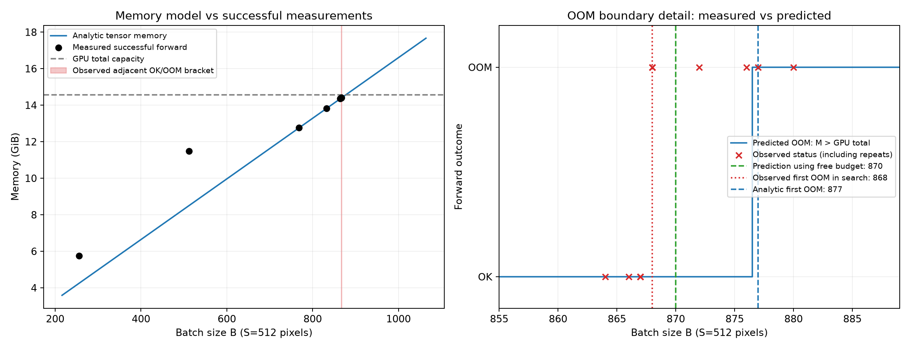

# Дополнительная проверка OOM

Это отдельный эксперимент за пределами основной сетки: S=512, B>256. Основные 132 измерения и калибровка не изменены.

GPU: Tesla T4, полная память 14.56 GiB. Каждый опыт выполнялся в новом процессе на cuda:0 с исходной моделью, FP32, eval(), inference_mode(), тремя прогревами и одним измеряемым forward. Все три флага benchmark/TF32 выключены. Искусственного ограничения памяти и посторонних тензоров не было.

Поиск дал соседние точки: **B=867 — OK; B=868 — настоящий torch.cuda.OutOfMemoryError**. Обе точки дополнительно проверены дважды; стабильность подтверждена: True.
Всего 18 запусков (14 разных батчей), из них 9 с OOM.

| B | Исход | Пик успешного forward, GiB | M(S,B), GiB | Прогноз OOM по полной памяти |
|---:|---|---:|---:|---|
| 256 | OK | 5.745 | 4.254 | OK |
| 512 | OK | 11.478 | 8.504 | OK |
| 768 | OK | 12.763 | 12.754 | OK |
| 832 | OK | 13.825 | 13.816 | OK |
| 864 | OK | 14.357 | 14.348 | OK |
| 866 | OK | 14.390 | 14.381 | OK |
| 867 | OK | 14.407–14.407 | 14.397 | OK |
| 868 | OOM | — | 14.414 | OK |
| 872 | OOM | — | 14.480 | OK |
| 876 | OOM | — | 14.547 | OK |
| 877 | OOM | — | 14.563 | OOM |
| 880 | OOM | — | 14.613 | OOM |
| 896 | OOM | — | 14.879 | OOM |
| 1024 | OOM | — | 17.004 | OOM |

## Сравнение с формулой

M(512,B)=4161296+68·512²·B байт. Коэффициенты формулы не подгонялись.
Первый предсказанный OOM по полной памяти: B=floor((GPU_total−4161296)/(68·512²))+1=877. Фактическая соседняя граница поиска — 868. Таким образом, формула допускает слишком большой батч.
Если вместо полной памяти брать свободную память перед входом плюс уже выделенные тензоры модели, предсказанная первая OOM-точка лежит в диапазоне 870–870; этот вариант также сохранён в CSV.
На всех пробах (включая повторы): пропущенных OOM по полной памяти — 5, ложных OOM — 0. Это результаты адаптивного поиска, а не независимая оценка частоты ошибок.

Относительное смещение первого OOM по полной памяти: (877−868)/868=1.04%. Учёт свободного бюджета уменьшает смещение, но не устраняет его полностью. Это сравнение порога без подгонки формулы.

Аналитика учитывает живые тензоры и индексы MaxPool, но не неизвестный workspace выбранных cuDNN kernels, округление/фрагментацию аллокатора и расходы вне max_memory_allocated. Поэтому OOM может возникнуть даже при M ниже полной памяти. Сообщения реальных исключений и этап отказа сохранены для каждой пробы в JSON и CSV. У неуспешного прохода полного пика памяти нет: поле memory пустое, peak_before_failure означает лишь максимум до исключения.

Двоичный поиск использует предположение о локально монотонной вместимости. Повторы подтверждают соседнюю границу в этой сессии, но не доказывают глобальную монотонность: при других размерах cuDNN может выбирать другие алгоритмы. Измерения времени/энергии основной работы не заменяются дополнительными опытами; энергия и медианная latency здесь не измерялись.

Воспроизведение из hw1/: `python oom_probe.py`, затем `python analyze_oom.py`.